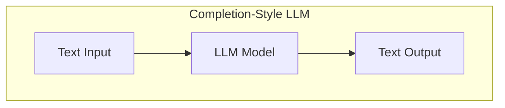
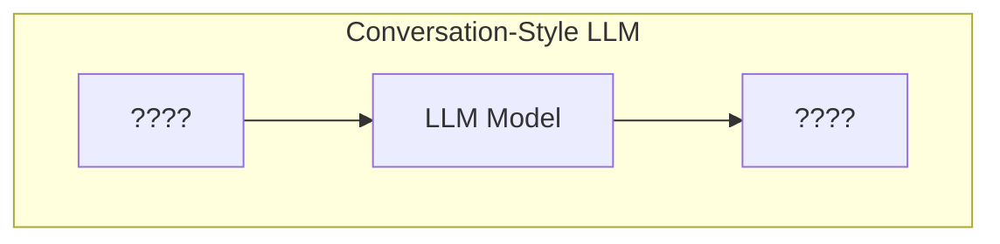

# Builing Python Based LLM Apps Using LangChain and OpenAI

## LLM Style
Styles in which LLMs respond to the queries

### Completion Style

### Conversation Style

A conversational-style LLM has 3 different inputs/outputs.

1. **User Input/Message**: The input from the user, which can be a question or a statement.
2. **System Input/Message**: The system message that provides context or instructions to the model.
   - Example: "You are a helpful assistant."
   - Example: "You are a helpful assistant that speaks like Shakespeare."
   - Example: "You are a helpful assistant that speaks like a pirate."
    - Example: "You are a helpful assistant that writes code like a senior fullstack python and javascript engineer"
3. **Assistant Output/Message**: The output generated by the LLM, which can be a response to the user's input.

**Limitations**: The conversational-style LLM is limited to a single conversation. It does not have memory of past conversations or the ability to recall previous interactions.

## Types Of Memory In LangChain

LagChain provides different types of memory to store and manage conversation history. These memory types can be used to enhance the capabilities of LLMs in various applications.

### Conversation Token Buffer Memory

### Combined Memory

### Conversation Buffer Window Memory

### Conversation Buffer Memory

### Conversation Summary Memory

## Typical LangChain Flow

```mermaid
flowchart TD
    subgraph "Basic LangChain Flow"
        A[User Query] --> B[Prompt Template]
        B --> C[LLM]
        C --> D[Output Parser]
        D --> E[Structured Response]
    end

    subgraph "LangChain with External Data"
        AA[User Query] --> BB[Document Loader]
        BB --> CC[Text Splitter]
        CC --> DD[Vector Store]
        AA --> EE[Query Construction]
        EE --> FF[Retriever]
        DD --> FF
        FF --> GG[Retrieved Documents]
        AA --> HH[Prompt Template]
        GG --> HH
        HH --> II[LLM]
        II --> JJ[Response]
    end

    subgraph "LangChain Agent Flow"
        AAA[User Query] --> BBB[Agent]
        BBB --> CCC{Which Tool?}
        CCC -->|Search| DDD[Search Tool]
        CCC -->|Calculate| EEE[Calculator Tool]
        CCC -->|Database| FFF[SQL Tool]
        DDD & EEE & FFF --> GGG[Tool Outputs]
        GGG --> HHH{Finished?}
        HHH -->|No| BBB
        HHH -->|Yes| III[Final Response]
    end
```

## LangChain Goals

3 big goals of LangChain are to:
1. Make it easy to build LLM applications
2. Make it easy to build LLM applications that use external data
3. Provide tools to automate each step of a text generation pipeline

## Learning Resources

- [LangChain Documentation](https://python.langchain.com/docs/introduction/)
- [OpenAI API Documentation](https://platform.openai.com/docs/overview)
- [OpenAI Playground](https://platform.openai.com/playground)
