# Builing Python Based LLM Apps Using LangChain and OpenAI

# Typical LangChain Flow

```mermaid
flowchart TD
    subgraph "Basic LangChain Flow"
        A[User Query] --> B[Prompt Template]
        B --> C[LLM]
        C --> D[Output Parser]
        D --> E[Structured Response]
    end

    subgraph "LangChain with External Data"
        AA[User Query] --> BB[Document Loader]
        BB --> CC[Text Splitter]
        CC --> DD[Vector Store]
        AA --> EE[Query Construction]
        EE --> FF[Retriever]
        DD --> FF
        FF --> GG[Retrieved Documents]
        AA --> HH[Prompt Template]
        GG --> HH
        HH --> II[LLM]
        II --> JJ[Response]
    end

    subgraph "LangChain Agent Flow"
        AAA[User Query] --> BBB[Agent]
        BBB --> CCC{Which Tool?}
        CCC -->|Search| DDD[Search Tool]
        CCC -->|Calculate| EEE[Calculator Tool]
        CCC -->|Database| FFF[SQL Tool]
        DDD & EEE & FFF --> GGG[Tool Outputs]
        GGG --> HHH{Finished?}
        HHH -->|No| BBB
        HHH -->|Yes| III[Final Response]
    end
```

## LangChain Goals

3 big goals of LangChain are to:
1. Make it easy to build LLM applications
2. Make it easy to build LLM applications that use external data
3. Provide tools to automate each step of a text generation pipeline

## Learning Resources

- [LangChain Documentation](https://python.langchain.com/docs/introduction/)
- [OpenAI API Documentation](https://platform.openai.com/docs/overview)
